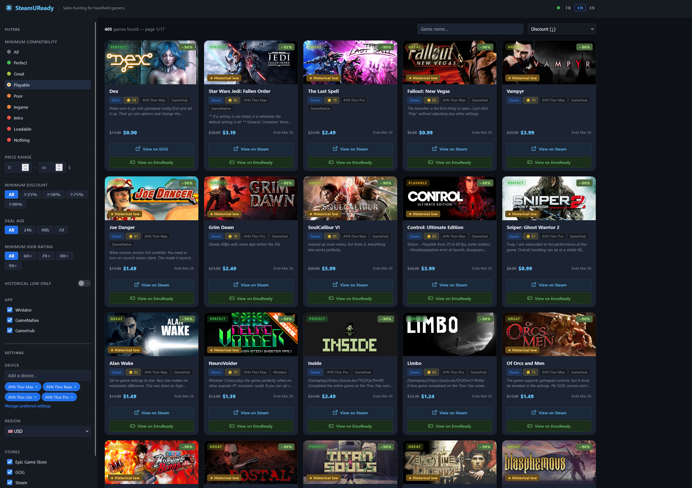

# SteamUReady

Cross-reference [EmuReady](https://www.emuready.com) emulation compatibility data with current deals from Steam, Epic Game Store, and GOG. Find discounted games that run well on your Android handheld.



## Features

- **Multi-store deal data** — powered by [IsThereAnyDeal](https://isthereanydeal.com/), covering Steam, Epic Game Store, and GOG
- **Full EmuReady catalog** — all compatibility listings, filtered to Android-native apps only (GameNative, GameHub / GameHub Lite, Winlator)
- **Multi-device / chipset selection** — filter by individual handhelds or by SoC (Snapdragon, Dimensity, etc.); preferred devices saved in localStorage
- **Compatibility filter** — set a minimum emulation performance level (Perfect → Nothing)
- **App filter** — narrow results to a specific app (Winlator, GameNative, GameHub, GameHub Lite)
- **Store filter** — choose which stores to include (Steam, Epic, GOG)
- **Controller support filter** — filter by Steam controller support level (Full / Partial / None)
- **IGDB ratings** — sort and filter by combined user + critic score
- **Price & discount filters** — min/max price range and minimum discount %
- **Historical low filter** — show only games at or below their all-time lowest price
- **Historical low badge** — at-a-glance indicator when a game hits its all-time low
- **Region selector** — 10 currency regions (USD, EUR, GBP, CAD, AUD, BRL, TRY, ARS, PLN)
- **Multi-language UI** — English, French, Spanish, German
- **Search, sort, paginate** — by name, price, discount, compatibility, or rating
- **Two-tier caching** — Redis for volatile price/correlation data; PostgreSQL for stable reference data (title mappings, controller support, IGDB ratings)

## Requirements

- **Node.js** 20+
- **Redis** — volatile caching (prices, correlation maps)
  - macOS: `brew install redis && brew services start redis`
  - Linux: `sudo apt install redis-server && sudo systemctl start redis`
  - Windows: [Memurai](https://www.memurai.com/) or WSL with `sudo service redis-server start`
  - Docker: `docker run -d -p 6379:6379 redis`
- **PostgreSQL** 14+ — persistent reference data (title mappings, controller support, IGDB ratings)
  - macOS: `brew install postgresql@16 && brew services start postgresql@16`
  - Linux: `sudo apt install postgresql && sudo systemctl start postgresql`
  - Docker: `docker run -d -p 5432:5432 -e POSTGRES_DB=steamuready -e POSTGRES_PASSWORD=postgres postgres:16`
  - Or use [docker-compose.yml](#local-development-with-docker-compose) below
- **IsThereAnyDeal API key** — free at [isthereanydeal.com/dev/app](https://isthereanydeal.com/dev/app/)

## Quick start

```bash
cp .env.example .env   # fill in ITAD_API_KEY, REDIS_URL, DATABASE_URL
npm install
npm start
```

Open [http://localhost:3000](http://localhost:3000).

Use `npm run dev` for auto-reload during development (requires nodemon).

## Local development with Docker Compose

```bash
docker compose up -d   # starts Redis + PostgreSQL
npm install
npm start
```

See [docker-compose.yml](docker-compose.yml) for the full configuration.

## Environment variables

| Variable | Required | Description |
|---|---|---|
| `ITAD_API_KEY` | Yes | IsThereAnyDeal API key |
| `DATABASE_URL` | Yes | PostgreSQL connection string (e.g. `postgresql://localhost:5432/steamuready`) |
| `REDIS_URL` | No | Redis connection string (default: `redis://localhost:6379`) |
| `IGDB_CLIENT_ID` | No | Twitch app client ID — enables IGDB ratings (register at [dev.twitch.tv/console](https://dev.twitch.tv/console)) |
| `IGDB_CLIENT_SECRET` | No | Twitch app client secret |
| `REFRESH_SECRET` | No | Bearer token to protect `POST /api/refresh` |
| `AWS_SECRETS_ARN` | No | ARN of an AWS Secrets Manager secret to load env vars from (production) |
| `PORT` | No | HTTP port (default: `3000`) |

## How it works

1. **EmuReady** — queries the public tRPC API for device/game/emulator/performance listings, filtered to Android-native apps
2. **Title resolution** — game titles are batch-looked-up via the ITAD `/lookup/id/title/v1` API to get ITAD UUIDs, then Steam `app/` IDs for cover art; results stored permanently in PostgreSQL (`game_titles` table) and only re-fetched for new titles
3. **Deal data** — ITAD `/games/overview/v2` returns current price, discount, store, and historical low for each resolved title; cached 1 h per region/store combination in Redis, updated incrementally
4. **Controller support** — fetched from the Steam store API (category IDs 28 = full, 18 = partial) and stored permanently in PostgreSQL; only missing entries are fetched at startup via `warmMissing()`
5. **IGDB ratings** — resolved via the IGDB API using the Steam app ID, cached in PostgreSQL for 7 days; covers total rating, user rating, and critic rating
6. **Correlation** — the final game map (EmuReady title → deal entry) is built once per device/region/store combination and cached 1 h in Redis
7. **Rate limiting** — new searches are limited to 10 per 10 s per IP (pagination exempt); enforced via Redis counters

## Seeding controller support

On first startup `warmMissing()` will fetch controller support from Steam for all known games. This takes ~10 minutes (Steam enforces ~40 req/min). To skip this on new deployments, pre-generate a seed file and import it:

```bash
# 1. Generate seed (requires DATABASE_URL to read game_titles)
node scripts/seed-controller-support.js

# 2. Import seed into a fresh DB
node scripts/import-controller-support.js
```

The seed file is written to `seeds/controller_support.json` and can be committed to the repo.

## API

| Endpoint | Description |
|---|---|
| `GET /api/games` | Correlated games (params: `deviceIds`, `socIds`, `compatRankMin`, `compatRankMax`, `maxPrice`, `minPrice`, `minDiscount`, `histLow`, `minRating`, `controllerSupport`, `search`, `sort`, `cc`, `page`, `shops`, `apps`, `newAge`) |
| `GET /api/devices` | All EmuReady devices |
| `GET /api/socs` | All EmuReady SoCs with listing counts |
| `GET /api/performance-scales` | Performance scale levels |
| `GET /api/regions` | Available currency regions |
| `GET /api/shops` | Available stores for the given `cc` region |
| `GET /api/status` | Health check + cache readiness flags |
| `POST /api/refresh` | Clear all caches (requires `Authorization: Bearer <REFRESH_SECRET>`) |

## Docker

```bash
docker build -t steamuready .
docker run \
  -e ITAD_API_KEY=your_key \
  -e DATABASE_URL=postgresql://host:5432/steamuready \
  -e REDIS_URL=redis://host:6379 \
  -p 3000:3000 \
  steamuready
```

The container uses `startup.js` as its entry point, which can optionally pull secrets from AWS Secrets Manager before booting the app (set `AWS_SECRETS_ARN`).

## Tech stack

- **Backend** — Node.js, Express, Helmet, Axios, Fuse.js
- **Persistent cache** — PostgreSQL (via pg) — title mappings, controller support, IGDB ratings
- **Volatile cache** — Redis (via ioredis) — prices, correlation maps, rate limiting
- **Deal data** — IsThereAnyDeal API
- **Ratings** — IGDB API (via Twitch OAuth)
- **Compatibility data** — EmuReady tRPC API
- **Frontend** — Vanilla JS, CSS (dark theme), i18n (EN/FR/ES/DE)
- No build step, no framework

## License

MIT
