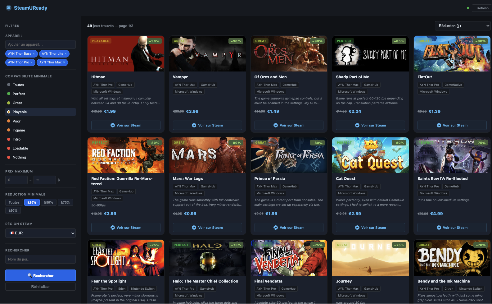

# SteamUReady

Cross-reference [EmuReady](https://www.emuready.com) emulation compatibility data with current Steam sales. Find discounted games that run well on your handheld device.



## Features

- **Full EmuReady catalog** — loads all 11,000+ compatibility listings
- **Full Steam sale catalog** — scrapes all 6,000+ currently discounted games
- **Fuzzy matching** — correlates game titles between both sources with structural validation
- **Multi-device selection** — pick one or more handhelds (AYN Odin/Thor, Steam Deck, Retroid, etc.)
- **Compatibility filter** — set a minimum emulation performance level (Perfect → Nothing)
- **Price & discount filters** — max price, minimum discount %
- **Region selector** — 10 Steam store regions (USD, EUR, GBP, BRL, TRY, ARS, PLN, etc.)
- **Search, sort, paginate** — by name, price, discount, compatibility
- **Smart caching** — first load ~3 min, then instant (~15ms) for 15–30 min

## Quick start

```bash
npm install
npm start
```

Open [http://localhost:3000](http://localhost:3000).

The first request will take ~3 minutes while it fetches all EmuReady listings (111 pages) and Steam sale pages (67+ pages). Subsequent requests are served from cache.

Use `npm run dev` for auto-reload during development (requires nodemon).

## How it works

1. **EmuReady** — queries the public tRPC API to fetch all device/game/emulator/performance listings
2. **Steam** — scrapes the Steam store search results (HTML) for all currently discounted games
3. **Correlation** — uses [Fuse.js](https://fusejs.io/) fuzzy matching to find EmuReady games in the Steam sale catalog, with structural validation to avoid false positives
4. **Caching** — raw data and correlation results are cached in-memory (EmuReady 30 min, Steam 15 min, correlation map 15 min)

## API

| Endpoint | Description |
|---|---|
| `GET /api/games` | Correlated games (params: `deviceIds`, `performanceId`, `maxPrice`, `minDiscount`, `search`, `sort`, `cc`, `page`) |
| `GET /api/devices` | All EmuReady devices |
| `GET /api/performance-scales` | Performance scale levels |
| `GET /api/regions` | Available Steam store regions |
| `POST /api/refresh` | Clear all caches |

## Tech stack

- **Backend** — Node.js, Express, Axios, Cheerio, Fuse.js
- **Frontend** — Vanilla JS, CSS (dark theme)
- No database, no build step, no framework

## License

MIT
